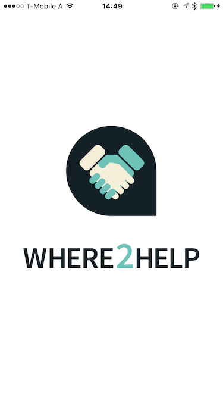
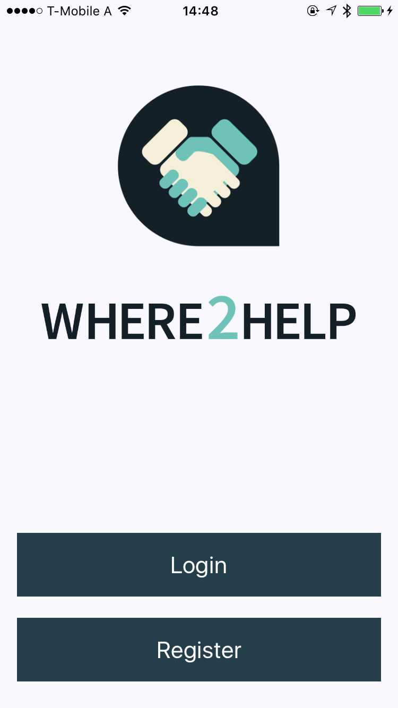
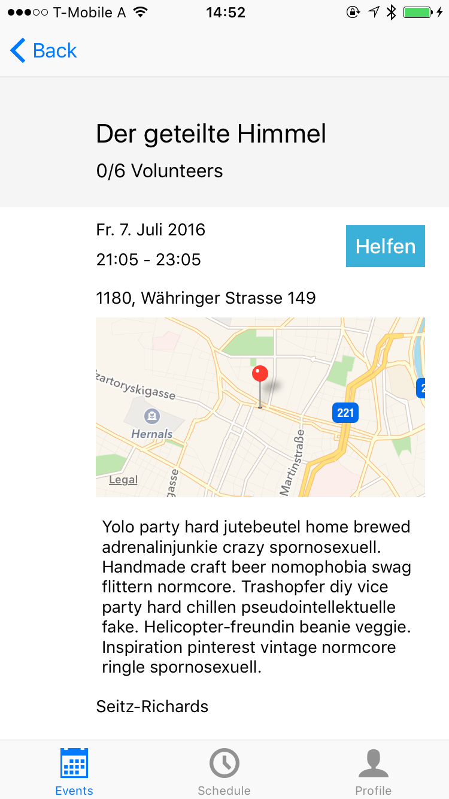

# Where2Help iOS Client

## Development

Install bundler

    $ gem install bundler

Install bundled gems

    $ bundle install

Install CocoaPods

    $ pod install

Start up Xcode

## Screenshots

### Start up

### Landing page

### Login

### Events

### Single Event

